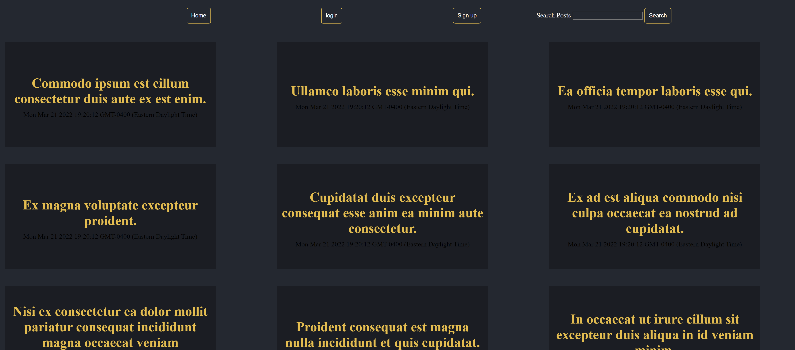
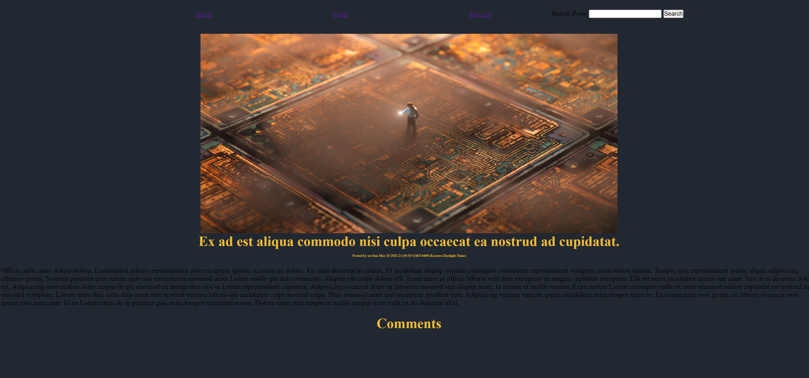
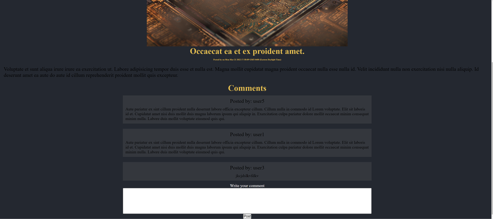
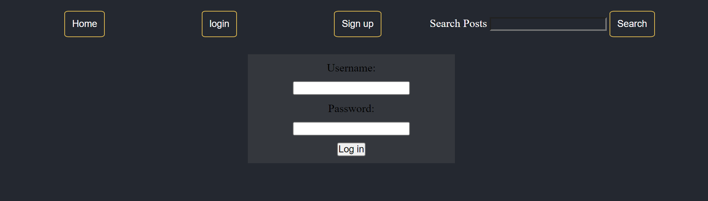
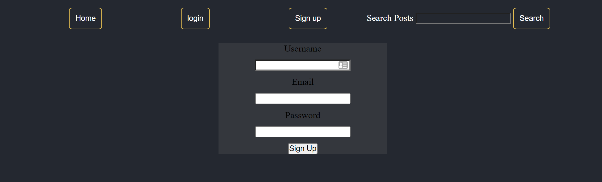
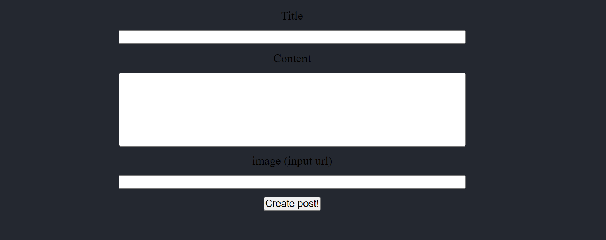

# My Blog

## Table of Contents

[Description](#description)  
[Installation](#installation)  
[Usage](#usage)  
[Utilizes](#utilizes)  
[Credits](#credits)  
[Questions](#questions)  
[License](#license)

## Description

This project was developed so that users can quickly and easily post about topics of their choosing, as well as comment on existing posts. As my first full-stack web application, it was an excellent introduction to backend/frontend integration, and also gave me the opportunity to work with new concepts like HTML templating and cookie storage. I also used this project as a means to familiarize myself with user input validation techniques using express middleware. Presently, I consider this an MVP build, and plan to introduce additional features and improvements in the future including the ability to search posts.

## Installation

This application is currently deployed on Heroku and does not require any installation. Simply follow the link below.

## Usage

The homepage consists of posts presented in tile format. Users can navigate to a single post's page by clicking on the title of the post. Here, the user will be presented with the posts content, as well as an image tied to the post.

Each post also contains a comment section. Logging in enables the user to post their own comment.

The navigation bar is present on every page the user visits. This was accomplished by including this element in the primary handlebars template. The navigation bar includes home, login and signup links.

The user can use the login link to navigate to a page where they can sign into the website.

To create a new account, the user can follow the signup link.

When the user is logged in, the navbar will present the following links instead.

This was accomplished through the use of conditional statements in the templates. In addition to having the option to log out of the website, the user can also choose to create a post by following its link. Upon doing so, the user will be presented with the following form:

The user can also view their post history by navigating to the dashboard page.

Dashboard posts also contain two additional links for editing and deleting the post.

## Utilizes

- HTML
- CSS
- JavaScript
- Node.js
- Handlebars
- Express
- Sequelize
- MySQL

## Questions

Feel free to shoot me any questions at the email below:

rrich.kray@gmail.com

find my GitHub profile by following the link below:

https://github.com/rrich-kray/

## License

MIT License

Copyright (c) 2022 Ryan Kray

Permission is hereby granted, free of charge, to any person obtaining a copy of this software and associated documentation files (the "Software"), to deal in the Software without restriction, including without limitation the rights to use, copy, modify, merge, publish, distribute, sublicense, and/or sell copies of the Software, and to permit persons to whom the Software is furnished to do so, subject to the following conditions:

The above copyright notice and this permission notice shall be included in all copies or substantial portions of the Software.

THE SOFTWARE IS PROVIDED "AS IS", WITHOUT WARRANTY OF ANY KIND, EXPRESS OR IMPLIED, INCLUDING BUT NOT LIMITED TO THE WARRANTIES OF MERCHANTABILITY, FITNESS FOR A PARTICULAR PURPOSE AND NONINFRINGEMENT. IN NO EVENT SHALL THE AUTHORS OR COPYRIGHT HOLDERS BE LIABLE FOR ANY CLAIM, DAMAGES OR OTHER LIABILITY, WHETHER IN AN ACTION OF CONTRACT, TORT OR OTHERWISE, ARISING FROM, OUT OF OR IN CONNECTION WITH THE SOFTWARE OR THE USE OR OTHER DEALINGS IN THE SOFTWARE.
