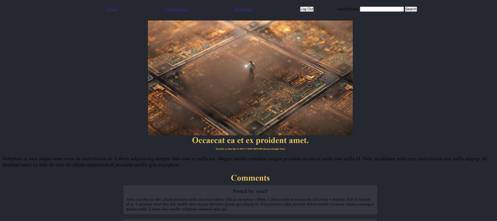

# My Blog

## Table of Contents

[Description](#description)  
[Installation](#installation)  
[Usage](#usage)  
[Utilizes](#utilizes)  
[Credits](#credits)  
[Questions](#questions)  
[License](#license)

## Description

This project was developed so that users can quickly and easily post about topics of their choosing, as well as comment on existing posts. As my first full-stack web application, it was an excellent introduction to backend/frontend integration, and also gave me the opportunity to work with new concepts like HTML templating and cookie storage. I also used this project as a means to familiarize myself with user input validation techniques using express middleware. Presently, I consider this an MVP build, and plan to introduce additional features and improvements in the future including the ability to search posts.

## Installation

This application is currently deployed on Heroku and does not require any installation. Simply follow the link below.

## Usage

The homepage consists of posts presented in tile format. Users can navigate to a single post's page by clicking on the title of the post. Here, the user will be presented with the posts content, as well as an image tied to the post.

Each post also contains a comment section. Logging in enables the user to post their own comment.

The navigation bar is present on every page the user visits. This was accomplished by including this element in the primary handlebars template. The navigation bar includes home, login and signup links.

The user can use the login link to navigate to a page where they can sign into the website.

To create a new account, the user can follow the signup link.

When the user is logged in, the navbar will present the following links instead.

This was accomplished through the use of conditional statements in the templates. In addition to having the option to log out of the website, the user can also choose to create a post by following its link. Upon doing so, the user will be presented with the following form:

The user can also view their post history by navigating to the dashboard page.

Dashboard posts also contain two additional links for editing and deleting the post.

## Utilizes

- HTML
- CSS
- JavaScript
- Node.js
- Handlebars
- Express
- Sequelize
- MySQL

## Questions

Feel free to shoot me any questions at the email below:

rrich.kray.93@gmail.com

find my GitHub profile by following the link below:

https://github.com/rrich-kray/

## License

Copyright (c) 2022, Ryan Kray
All rights reserved.

This source code is licensed under the BSD-style license found in the LICENSE file in the root directory of this source tree and reroduced below.

Redistribution and use in source and binary forms, with or without modification, are permitted provided that the following conditions are met:

1. Redistributions of source code must retain the above copyright notice, this list of conditions and the following disclaimer.
2. Redistributions in binary form must reproduce the above copyright notice, this list of conditions and the following disclaimer in the documentation and/or other materials provided with the distribution.
3. All advertising materials mentioning features or use of this software must display the following acknowledgement: This product includes software developed by Ryan Kray.
4. Neither the name of this application's developer nor the names of its contributors may be used to endorse or promote products derived from this software without specific prior written permission.

THIS SOFTWARE IS PROVIDED BY THE COPYRIGHT HOLDER ''AS IS'' AND ANY EXPRESS OR IMPLIED WARRANTIES, INCLUDING, BUT NOT LIMITED TO, THE IMPLIED WARRANTIES OF MERCHANTABILITY AND FITNESS FOR A PARTICULAR PURPOSE ARE DISCLAIMED. IN NO EVENT SHALL THE COPYRIGHT HOLDER OR CONTRIBUTORS BE LIABLE FOR ANY DIRECT, INDIRECT, INCIDENTAL, SPECIAL, EXEMPLARY, OR CONSEQUENTIAL DAMAGES (INCLUDING, BUT NOT LIMITED TO, PROCUREMENT OF SUBSTITUTE GOODS OR SERVICES; LOSS OF USE, DATA, OR PROFITS; OR BUSINESS INTERRUPTION) HOWEVER CAUSED AND ON ANY THEORY OF LIABILITY, WHETHER IN CONTRACT, STRICT LIABILITY, OR TORT (INCLUDING NEGLIGENCE OR OTHERWISE) ARISING IN ANY WAY OUT OF THE USE OF THIS SOFTWARE, EVEN IF ADVISED OF THE POSSIBILITY OF SUCH DAMAGE.
